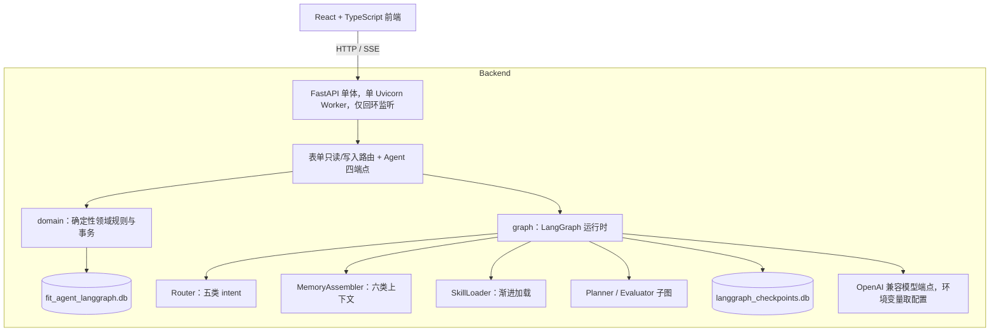

# Fit-Agent

基于 FastAPI、SQLite 与 LangGraph 的本地单用户健身训练助手：表单打卡与身体数据、确定性统计看板、
Planner／Evaluator 计划链路，以及自然语言打卡的解析确认。

## 完成范围

- **表单写入**：训练与身体数据的新增、修改、物理删除；写入即由确定性代码重算统计。
- **数据看板**：三类 PB（最大重量／最大次数／最长时长）、最近 30 天体重与体脂点、力量累计 PB 序列、
  月历与确定性趋势摘要。PB、趋势与单次日程状态全部现算，不落表，不计算完成率。
- **计划日程**：关联可空（额外训练不关联计划日程），同一日程最多被一次训练关联。
- **Agent 运行时**：LangGraph State ＋ 独立 SQLite Checkpointer；确定性 Intent Router（五类 intent）；
  MemoryAssembler 六类上下文；SkillLoader 启动只注入元数据、命中后才加载正文。
- **计划链路**：Planner / Evaluator 生成、评估、最多一次修订；draft 经确认启用或拒绝归档；
  数据库任意时刻至多一个 active 计划。
- **自然语言打卡**：模型结构化提取 → 服务端 Pydantic／领域／目录复验 → 按训练日查询数据库候选日程 →
  可读摘要 → 用户确认后复用表单写入服务；未确认不写业务库，多候选不自动关联。
- **前端五个页面**：对话、数据看板、训练计划、用户画像、训练记录；只展示后端统计，不重算 PB／趋势。

## 未完成项

- `fitness-onboarding`、`workout-review` 两个 Skill；聊天历史摘要节点；MCP。
- 记忆消融实验与正式 Agent 评测。
- 完成率、估算 1RM、训练容量、RIR、计划状态时间字段。
- Checkpoint 查询端点、拖拽排程、完整计划编辑器。
- 登录／RBAC／多租户／公网部署。

## 架构



- **单体进程**：`main.py` 装配 `api/app.py`，单 Worker，只允许回环地址（Host／Origin 回环校验）。
- **业务库**：SQLite `fit_agent_langgraph.db`，经 `aiosqlite` 单一连接 ＋ `asyncio.Lock` 串行化，
  手写 SQL 只在 `domain/*/repo.py`，编号迁移逐个文件在同一事务内执行。
- **Checkpointer**：LangGraph 的 SQLite 存档写在**独立文件** `langgraph_checkpoints.db`，与业务库
  不同连接、不同库；`conversation_id` 即 `thread_id`。
- **domain**：`actions`／`body_metrics`／`plans`／`profile`／`records`／`stats` 六个模块，纯确定性规则，
  不依赖 FastAPI／LangGraph／模型 SDK。
- **graph**：`router.py`（五类 intent，确定性词表优先、零／多命中才调一次分类模型）、`context.py`
  （MemoryAssembler）、`skills.py`（SkillLoader）、`nodes.py` ＋ `workflow.py`（计划子图与 Run 事件流）、
  `model.py`（唯一模型入口，60s 单请求超时、180s Run 时限、每 Run 最多 5 次请求）。
- **SSE**：`node`／`message`／`waiting`／`done`／`error` 五类产品事件；`waiting` 在计划路径携带
  `draft_plan_id`，在自然语言打卡路径携带结构化 `workout` 与数据库候选 `candidate_plan_sessions`。

## 目录

```text
backend/
├── config.py                 # 数据目录、业务库/存档文件名、MODEL_* 环境变量常量与 Run 上限
├── business_time.py          # 业务时区与业务自然日
├── main.py                   # 进程入口（单 Worker、回环监听）
├── api/                      # FastAPI 工厂、DTO 与错误映射、表单路由、Agent 四端点
├── domain/                   # actions / body_metrics / plans / profile / records / stats
├── graph/                    # checkpointer / context / model / nodes / router / skills / state / workflow
├── skills/                   # workout-planning、plan-adjustment（SKILL.md ＋ references）
├── storage/                  # 连接与事务、编号迁移（001–003）
└── tests/                    # pytest（含按 Stage 冻结契约的断言）

frontend/
├── src/app/App.tsx           # 路由与导航
├── src/features/             # chat / dashboard / plans / profile / records
├── src/lib/api.ts            # 端点与 SSE 客户端
├── src/lib/contract.ts       # 后端传输形状的前端契约
└── scripts/                  # 前端可执行契约验证脚本
```

## 本地配置

复制 `.env.example` 为 `.env`：

```dotenv
MODEL_API_KEY=
MODEL_BASE_URL=
MODEL_MODEL=
```

| 环境变量 | 用途 |
| --- | --- |
| `MODEL_API_KEY` | OpenAI 兼容端点的 API Key |
| `MODEL_BASE_URL` | OpenAI 兼容端点的 Base URL |
| `MODEL_MODEL` | 模型名 |
| `FIT_AGENT_DATA_DIR` | 覆盖本地数据目录（默认取系统用户数据目录） |

- 三个 `MODEL_*` 变量在**首次模型调用时**才校验：缺失时服务仍可启动，非模型业务可用；
  `/healthz` 只报 `provider_has_api_key` 布尔状态，不回显任何取值。
- 环境变量名与 `backend/config.py`、`.env.example` 一致。

## 数据库

新版使用 `fit_agent_langgraph.db`（迁移 `001`–`003`），与旧版 `app.db` **不兼容**：不读取、不迁移旧数据。
首次启动在数据目录创建新库并执行迁移；LangGraph Checkpoint 存档单独放在 `langgraph_checkpoints.db`。

## 运行

```bash
cd backend
uv sync --group dev --locked
uv run main.py
```

服务仅允许监听 `127.0.0.1`、`localhost` 或 `::1`，默认 <http://127.0.0.1:8000>。

前端：

```bash
cd frontend
npm install
npm run build   # 构建产物由后端静态托管
npm run dev     # 前端开发服务器
```

## 测试与 Gate

```bash
cd backend && uv run pytest
cd backend && uv run ruff check .
cd frontend && npm run build
```

前端另有可执行契约验证脚本（Node 原生，无测试框架）：

```bash
cd frontend && npm run verify:stage5
cd frontend && npm run verify:stage6
```

## 人工闭环演示

闭环演示按以下顺序执行：临时数据目录启动应用并确认创建 `fit_agent_langgraph.db` → 表单新增训练与
身体数据并查看月历／趋势／PB → 生成计划（Evaluator 触发一次修订）→ 确认启用（仅一个 active）与
拒绝归档（原 active 不变）→ 自然语言打卡确认写入（记录与 PB 立即一致）→ 多候选日程歧义不自动关联、
零候选需显式「额外训练」→ 急性关键词命中不生成计划、不写打卡。

演示通过真实 FastAPI 应用（真实 lifespan、真实业务库、真实 SSE 响应）驱动；模型使用固定替身，
因此不需要 `MODEL_*` 配置，硬规则不依赖真实模型随机性。
