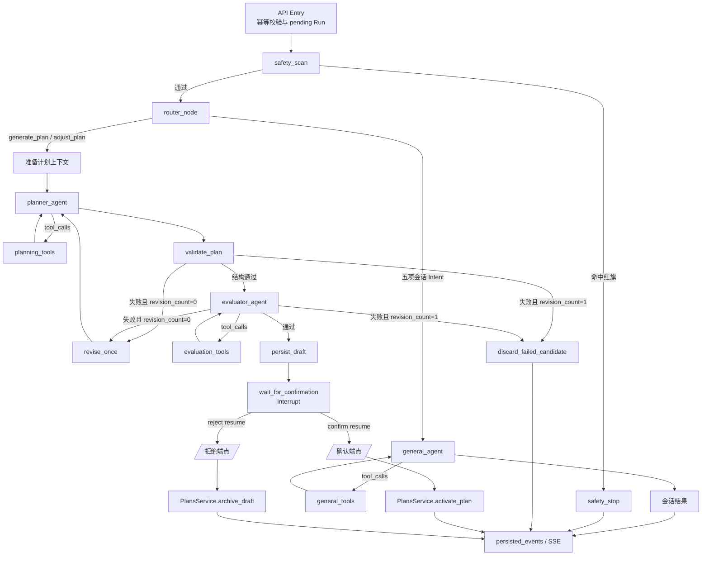

# Fit-Agent 重构设计：Node 拓扑与图状态编排方案

- 文档状态：Draft for Implementation
- 架构角色：全局拓扑主控
- 上游依赖：无
- 下游文档：
  - 《Tool 体系与数据事实层重构方案》
  - 《Skill 体系与领域知识工程重构方案》
- 依据：`docs/fit_agent_architecture_specification.html`、`docs/lzheng-fitness-skills.md`

## 1. 设计目标与约束

### 1.1 目标

本方案将一次用户请求统一编排为可检查、可中断、可恢复、可重放的 LangGraph Run，并固定以下职责：

1. API Entry 建立幂等请求身份和 pending Run。
2. 确定性节点承担安全扫描、结构校验、有限重试路由和终态收敛。
3. Router、General、Planner、Evaluator 四个 LLM Node 仅产出分类、消息、结构化候选和评审结论。
4. 三个 ToolNode 仅调用只读 Tool，并由 Runtime 注入用户身份与事实快照。
5. 全部持久化操作归 Application Services；计划 draft 在评审通过后持久化，计划激活、draft 归档和训练记录提交由用户确认端点触发。
6. 每个产品事件先持久化，再通过 SSE 发出；同一 `client_request_id` 只执行一次。

### 1.2 强制边界

| 边界 | 规则 |
|---|---|
| LLM Node | 无 Repository、数据库连接、事务对象和写入 Service；仅接收状态、Skill Bundle、ToolResult |
| ToolNode | 仅绑定只读 Tool；模型参数中不暴露 `user_id`、`run_id` 和 revision 注入字段 |
| Tool | 读取当前用户事实；结果携带事实域 revision；禁止产生业务副作用 |
| Deterministic Node | 执行纯规则、路由、计数和载荷整形；持久化节点只能委托 Application Service |
| Application Service | 拥有业务校验、事务、幂等、状态迁移和 revision bump |
| Graph State | 保存 Run 编排事实、内存候选和终态结果；禁止放入 Repository、连接和可变全局对象 |
| Checkpoint | 保存可恢复的图状态与 interrupt；业务数据库仍是计划、训练和会话事实源 |

### 1.3 写入分类

| 写入 | 触发点 | 所有者 | 原子性要求 |
|---|---|---|---|
| Entry、Run、事件 | API 接收与事件发送前 | Conversation Application Service / Repository | Entry 与 pending Run 同事务；事件与 Run 状态同事务 |
| 通过评审的 plan draft | `persist_draft` | `PlansService` | 唯一 draft、保留 active、递增 plans revision |
| active plan 与 sessions | `/api/agent/confirm` | `PlansService.activate_plan` | 归档旧 active、激活 draft、创建日程、revision bump 同事务 |
| draft 归档 | `/api/agent/reject` | `PlansService.archive_draft` | `draft -> archived` 与 revision bump 同事务 |
| workout session 与 sets | `/api/agent/confirm-workout` | `RecordsService.commit_workout` | session、sets、日程关联、workouts revision 同事务 |

二次评审失败的 `PlanDraft` 只存在于 `WorkflowState`，进入 `discard_failed_candidate` 后结束，不新增 `plans` 行。

## 2. 全局图拓扑与状态机



## 3. 强类型状态契约

### 3.1 `WorkflowState`

目标状态定义放置于 `backend/app/application/agent/contracts.py`：

```python
from datetime import date
from typing import Annotated, Literal, TypedDict

from langchain_core.messages import AnyMessage
from langgraph.graph.message import add_messages


Intent = Literal[
    "form_record",
    "natural_language_record",
    "view_progress",
    "generate_plan",
    "adjust_plan",
    "view_schedule",
    "general",
]

ConfirmationStatus = Literal["pending", "confirmed", "rejected"]
TerminationReason = Literal[
    "safety_stop",
    "discard_failed_candidate",
    "archive_draft",
]


class WorkflowState(TypedDict, total=False):
    # Run 身份
    run_id: str
    conversation_id: str
    user_id: str
    client_request_id: str
    business_day: date

    # 请求与路由
    request: str
    intent: Intent | None
    safety_hits: tuple[str, ...]

    # Agent loop
    messages: Annotated[list[AnyMessage], add_messages]
    ui_actions: tuple[dict[str, object], ...]

    # 计划候选与评审
    plan_draft: PlanDraft | None
    evaluation_result: EvaluationResult | None
    revision_count: Literal[0, 1]
    revision_feedback: tuple[str, ...]

    # 持久化衔接
    draft_plan_id: int | None
    confirmation: ConfirmationStatus | None

    # 终态
    termination_reason: TerminationReason | None
    final_result: AgentRunResult | None
```

字段约束：

- `run_id`、`user_id`、`client_request_id`、`business_day` 由 API/Runtime 注入，LLM 无权生成或覆盖。
- `messages` 使用 LangGraph reducer 追加，节点返回增量消息。
- `plan_draft` 始终是 Pydantic `PlanDraft`，其七天窗口由 Schema 校验。
- `evaluation_result` 始终是 Pydantic `EvaluationResult`。
- `revision_count` 初始值为 `0`，唯一合法增量为 `0 -> 1`。
- `draft_plan_id` 只由 `persist_draft` 写入 State。
- `final_result` 只由终态收敛节点写入。

### 3.2 `ToolExecutionContext`

该上下文由 Runtime 构造并注入 ToolNode。模型可见的 Tool Schema 不包含身份字段。

```python
from dataclasses import dataclass
from datetime import date


@dataclass(frozen=True, slots=True)
class ToolExecutionContext:
    user_id: str
    run_id: str
    business_day: date
    profile_revision: int
    workouts_revision: int
    plans_revision: int
    catalog_revision: int
```

一致性规则：

1. Run 第一次进入 ToolNode 时解析四个 revision，形成事实快照键。
2. 同一 Run 的 General、Planner、Evaluator 复用相同 revision 集合。
3. ToolResult 必须返回自身使用的 `revision` 或 `revisions`。
4. Evaluator 发现 ToolResult revision 与候选计划证据不一致时，输出阻断失败 `snapshot_mismatch`。
5. 确认端点重新读取当前事实并执行确定性再校验，避免 checkpoint 与业务库之间的时间差写入失效计划。

### 3.3 标准 ToolResult 接口

详细字段由下游 Tool 文档定稿；Node 层固定最小封装：

```python
class ToolEvidence(BaseModel):
    tool_name: str
    revision_domain: Literal["profile", "workouts", "plans", "catalog"]
    revision: int


class ToolResult[T](BaseModel):
    data: T
    evidence: tuple[ToolEvidence, ...]
```

### 3.4 标准 Skill 接口

详细加载协议由下游 Skill 文档定稿；Node 层只依赖以下接口：

```python
class SkillBundle(BaseModel):
    names: tuple[str, ...]
    system_instructions: str
    references: tuple[str, ...]
    version: str
```

Skill 不持有用户事实、Repository、数据库连接和写入函数。专业结论必须引用当前 Run 的 Tool 事实。

## 4. 入口与确定性控制节点

### 4.1 API Entry

**输入**

- `AgentRunBody.request`
- `chat_id` / `conversation_id`
- `client_request_id`
- 认证上下文中的 `user_id`
- 注入的 `business_day`

**内部逻辑**

1. 校验会话存在且归属当前用户。
2. 按 `client_request_id` 查询既有 Run。
3. 已存在时校验 `chat_id/thread_id/user_id` 身份一致，并重放已持久化事件。
4. 新请求在单个事务内写入用户 Entry 与 pending Run。
5. 初始化 `WorkflowState` 和 `ToolExecutionContext`。
6. 启动 `persisted_events(run_events(...))` 流。

**输出**

- SSE 响应；
- 新 Run 的初始状态，或既有 Run 的事件重放。

**源码索引**

- `backend/app/api/routes_agent.py:42-104`
- `backend/app/application/agent/run_service.py:573-699`

### 4.2 `safety_scan`

**输入**：`request`。

**逻辑**：调用 `message_red_flag_hits` 扫描封闭红旗词表；该节点位于 Router、LLM Agent 和 ToolNode 之前。

**输出**：

- 无命中：`safety_hits=()`；
- 有命中：`safety_hits=(...)`、`termination_reason="safety_stop"`。

**边**：命中进入 `safety_stop`，通过进入 `router_node`。

**源码索引**

- `backend/app/domain/profile/safety.py:3-19`
- 当前计划子图实现：`backend/app/application/agent/plan_nodes.py:63-76`
- 当前顶层前置扫描：`backend/app/application/agent/run_service.py:114-121`

### 4.3 `safety_stop`

**输入**：`safety_hits`。

**逻辑**：生成固定安全消息，跳过模型、Tool 和业务写入。

**输出**：

- `termination_reason="safety_stop"`
- 固定安全 `message`
- `final_result`

**源码索引**

- `backend/app/application/agent/plan_nodes.py:77-85`
- 可见消息映射：`backend/app/application/agent/run_service.py:159-166`

### 4.4 `validate_plan`

**输入**

- `plan_draft`
- 当前画像的明确每周频率与禁用动作
- canonical exercise catalog
- 有效工作组
- 调整计划时的 active plan 与关联训练身份

**内部逻辑**

1. Pydantic Schema 校验七天窗口、训练日数量、处方判别联合和字段严格性。
2. `validate_plan_draft` 校验频率、动作存在性、推荐状态、记录口径、禁用动作和负荷来源。
3. `validate_plan_adjustment` 追加 active 来源和 10B/10B-1 渐进决策检查。
4. 全量返回 `RuleFailure`，供一次修订使用。

**输出**：`DeterministicResult`。

**边**：

- 通过：进入 `evaluator_agent`；
- 首次失败：进入 `revise_once`；
- 修订后失败：进入 `discard_failed_candidate`。

**源码索引**

- `backend/app/domain/plans/schema.py:31-239`
- `backend/app/domain/plans/rules.py:37-406`
- 当前调用位置：`backend/app/application/agent/plan_nodes.py:124-166`

### 4.5 `revise_once`

**输入**

- `plan_draft`
- `evaluation_result` 或确定性失败结果
- `revision_count`

**内部逻辑**

1. 仅接受 `revision_count == 0`。
2. 把上一版候选和结构化失败原因写入 Planner 输入。
3. 设置 `revision_count=1`。
4. 复用原 `ToolExecutionContext` 和事实快照。

**输出**：修订请求上下文；下一跳为 `planner_agent`。

**不变量**：不存在第二次回环；`revision_count <= 1`。

**源码索引**

- `backend/app/application/agent/plan_nodes.py:168-197`
- 当前路由：`backend/app/application/agent/plan_graph.py:45-56`

### 4.6 `discard_failed_candidate`

**输入**：第二次失败的 `plan_draft`、`evaluation_result`。

**逻辑**：清除可持久化候选引用，生成受控失败消息并结束 Run。

**输出**：

- `termination_reason="discard_failed_candidate"`
- `draft_plan_id=None`
- `final_result`

**数据库效果**：`plans`、`plan_sessions` 保持不变。

**源码索引**

- 当前待替换节点：`backend/app/application/agent/plan_nodes.py:237-246`
- 当前待替换边：`backend/app/application/agent/plan_graph.py:112-116`

当前 `reject_draft` 会调用 `persist_plan_result` 写入 rejected 行；重构后删除该调用，节点更名为 `discard_failed_candidate`。

### 4.7 `wait_for_confirmation`

**输入**：`draft_plan_id`、`run_id`、`conversation_id`。

**逻辑**：调用 LangGraph `interrupt`，载荷仅包含确认所需的稳定身份。

```json
{
  "kind": "plan_confirmation",
  "run_id": "...",
  "draft_plan_id": 123
}
```

恢复载荷：

```json
{
  "action": "confirm",
  "run_id": "...",
  "plan_id": 123
}
```

恢复时必须校验 Run、会话、用户和 plan 身份一致。

**输出**：`confirmation="confirmed" | "rejected"`。

**源码索引**

- `backend/app/application/agent/plan_nodes.py:209-215`
- `backend/app/application/agent/plan_graph.py:137-196`

## 5. LLM Node 与 ToolNode 编排

### 5.1 通用执行契约

每个 LLM Node 具有以下固定输入面：

- 当前任务所需的最小 `WorkflowState` 投影；
- 当前 Intent 对应的 `SkillBundle`；
- 当前 Node 的 Tool 白名单；
- 模型请求预算与超时；
- 结构化输出 Schema。

每个 ToolNode 具有以下固定执行规则：

1. Tool 集合在图编译或 Intent 路由时固化。
2. `ToolExecutionContext` 通过 `ToolRuntime` 注入。
3. Tool 调用预算、单次超时和 Run 总超时统一生效。
4. Tool 异常原样上抛，由 Run 错误边界收敛。
5. ToolResult 可按 `run_id + tool_name + normalized_args + revisions` 缓存。
6. ToolNode 不配置业务写入 Tool。

### 5.2 `router_node`

**输入**

- `request`
- 当前请求之前的 `conversation_messages`

**系统提示词定位**

- `backend/app/application/agent/router.py:81-112` 的 `ROUTER_SYSTEM_PROMPT`

**输出 Schema**

```python
class FitnessIntent(BaseModel):
    domain: Literal["workout_execution", "plan_management", "analytics", "general"]
    action: Literal["query", "create", "modify", "chat"]
    execution_type: Literal[
        "schedule_query", "form_record", "natural_language_record"
    ] | None
```

**七项映射**

| Intent | FitnessIntent 组合 | 下游 |
|---|---|---|
| `view_schedule` | workout_execution/query/schedule_query | General |
| `form_record` | workout_execution/create/form_record | General |
| `natural_language_record` | workout_execution/create/natural_language_record | General |
| `generate_plan` | plan_management/create/null | Planner |
| `adjust_plan` | plan_management/modify/null | Planner |
| `view_progress` | analytics/query/null | General |
| `general` | general/chat/null | General |

**源码索引**

- `backend/app/application/agent/router.py:11-140`
- 当前调用：`backend/app/application/agent/run_service.py:114-145`

### 5.3 `general_agent` 与 `general_tools`

**职责**

统一承载表单生成、自然语言训练记录抽取、日程查询、进展查询和基础训练问答。

**输入**

- `request`
- `messages`
- `business_day`
- `intent`
- Intent 对应 `SkillBundle`
- Intent 对应 Tool 白名单

**系统提示词定位**

- 通用问答：`backend/app/application/agent/prompts.py` 的 `GENERAL_CHAT_SYSTEM_PROMPT`
- Tool loop：同文件的 `TOOL_HARNESS_SYSTEM_PROMPT`
- 自然语言打卡：同文件的 `NATURAL_LANGUAGE_RECORD_EXTRACTION_PROMPT` 与 `NATURAL_LANGUAGE_RECORD_MESSAGE_PROMPT`

**输出**

```python
class GeneralAgentOutput(BaseModel):
    message: str
    ui_actions: tuple[dict[str, object], ...] = ()
```

`ui_actions` 的标准类型至少包含：

- `workout_form`
- `workout_confirmation`
- `schedule_view`
- `progress_view`

**Tool 使用约束**

| Intent | 强制 Tool | 可选共享 Tool |
|---|---|---|
| `form_record` | `get_workout_record_form` | 无 |
| `natural_language_record` | `prepare_workout_record` | `search_exercises` |
| `view_schedule` | `read_active_plan`、`read_training_calendar` | 无 |
| `view_progress` | `read_progress`、`read_training_history` | `read_active_plan` |
| `general` | 无 | 画像、目录、历史、计划只读 Tool |

**源码索引**

- 当前分支编排：`backend/app/application/agent/run_service.py:114-501`
- Tool loop：`backend/app/application/agent/harness/graph.py:21-58`
- 当前训练 Tool：`backend/app/application/agent/harness/tools/training.py`

### 5.4 `planner_agent` 与 `planning_tools`

**职责**

根据画像、历史、进展、动作目录与计划事实生成严格七天 `PlanDraft`。调整场景必须读取 active plan 和日历。

**输入**

- `request`
- `intent`
- `business_day`
- `revision_count`
- 修订时的 `previous_plan` 与结构化失败原因
- `workout-planning` 或 `plan-adjustment` Skill Bundle
- `planning_tools` 返回的事实和 revision evidence

**系统提示词定位**

- `backend/app/application/agent/prompts.py` 的 `PLANNER_SYSTEM_PROMPT`
- 同文件的 `ADJUSTMENT_PLANNER_SYSTEM_PROMPT`

**输出**：`PlanDraft`。

**Tool 白名单**

- `read_user_profile`
- `read_active_plan`
- `read_training_calendar`
- `read_training_history`
- `read_progress`
- `search_exercises`

`generate_plan` 强制读取画像、训练历史、进展和动作目录；`adjust_plan` 追加 active plan 与训练日历。候选动作只能使用 `search_exercises` 返回的 canonical `exercise_id`。

**源码索引**

- 当前 Planner：`backend/app/application/agent/plan_nodes.py:124-138`
- 当前上下文装配：`backend/app/application/agent/plan_nodes.py:87-123`
- 当前 `PlanDraft`：`backend/app/domain/plans/schema.py:150-184`

### 5.5 `evaluator_agent` 与 `evaluation_tools`

**职责**

独立核查 `PlanDraft` 与同一 Run 事实快照的一致性。确定性规则先执行；规则通过后运行模型 Rubric。

**输入**

- `plan_draft`
- `plan-evaluation` Skill Bundle
- `evaluation_tools` 的独立查询结果
- Planner 候选所引用的 revision evidence
- `revision_count`

**系统提示词定位**

- `backend/app/application/agent/prompts.py` 的 `EVALUATOR_SYSTEM_PROMPT`

**输出**：`EvaluationResult`，包含：

- `passed`
- `deterministic`
- `rubric.goal_alignment`
- `rubric.schedule_reasonableness`
- `rubric.explanation_quality`
- `blocking_failures`
- `warnings`
- `revision_count`
- 下游 Tool 文档补充的 `evidence`

**Tool 白名单**

与 Planner 使用同六个只读 Tool，独立设置调用预算和强制证据规则。所有结果必须匹配同一组 revision。

**源码索引**

- `backend/app/application/agent/plan_nodes.py:139-166`
- `backend/app/domain/plans/schema.py:187-239`

## 6. Tool 与 Skill 接口预留

### 6.1 三个 ToolNode

| ToolNode | 调用者 | 白名单选择方式 | 写权限 |
|---|---|---|---|
| `general_tools` | `general_agent` | 按五项会话 Intent 取子集 | 无 |
| `planning_tools` | `planner_agent` | 按 generate/adjust 取强制集合 | 无 |
| `evaluation_tools` | `evaluator_agent` | 固定六项事实 Tool | 无 |

三个 ToolNode 复用 Tool Registry 和底层查询服务，各自拥有独立白名单、预算、调用轨迹和节点名。

### 6.2 只读 Tool Registry

| Tool | General | Planner | Evaluator | 返回核心事实 |
|---|---:|---:|---:|---|
| `get_workout_record_form` | 是 |  |  | `WorkoutFormPayload` |
| `prepare_workout_record` | 是 |  |  | `WorkoutConfirmationPayload` |
| `read_active_plan` | 是 | 是 | 是 | active plan + `plans_revision` |
| `read_training_calendar` | 是 | 是 | 是 | sessions + `plans_revision` |
| `read_progress` | 是 | 是 | 是 | PB、体重变化、停训天数 + revisions |
| `read_training_history` | 是 | 是 | 是 | sessions + `workouts_revision` |
| `read_user_profile` | 是 | 是 | 是 | 三态画像 + `profile_revision` |
| `search_exercises` | 是 | 是 | 是 | canonical exercises + `catalog_revision` |

`search_exercises` 在真实动作数据源接入前仅保留 Contract；缺少实现时快速失败。

### 6.3 Skill 装载矩阵

| Node | 固定或条件 Skill |
|---|---|
| General | `fitness-knowledge`、`exercise-guidance`、`strength-training`、`workout-logging`、`training-review`、`training-expert-library` |
| Planner | `workout-planning`、`plan-adjustment`、`training-return`、`strength-training`、`training-expert-library` |
| Evaluator | `plan-evaluation`、`strength-training`、`training-expert-library` |

领域范围固定为七天计划、训练记录、训练进展、体重和训练知识。长周期、营养、视频学习、知识库工作台不进入本次图拓扑。

专家库作为 Skill 内部知识层加载，不创建独立 Node，不取得 Tool 或写入权限。红旗请求在专家选择之前由 `safety_scan` 结束。

## 7. 业务写入服务与事件持久化

### 7.1 `PlansService.persist_draft`

**调用点**：Evaluator 通过后、进入 interrupt 前。

**输入**

- `plan_draft`
- `evaluation_result`
- `source_run_id`
- 调整场景的 `source_plan_id`
- 可选 `existing_draft_id`

**要求**

- 只接受 `evaluation_result.passed=True`。
- 保证最多一个 draft。
- 替换 draft 时执行状态条件更新。
- active plan 全字段保持不变。
- 成功后递增 plans revision。

**输出**：`draft_plan_id`。

**源码索引**

- 当前服务：`backend/app/application/services/plans_service.py:29-149`
- 当前节点：`backend/app/application/agent/plan_nodes.py:199-207`

### 7.2 `PlansService.activate_plan`

**调用点**：确认端点校验恢复身份后。

**事务内容**

1. 校验目标存在且状态为 draft。
2. 校验 `starts_on >= business_day`。
3. 使用当前画像、目录、有效工作组和 active 来源重新执行确定性规则。
4. 归档旧 active。
5. 取消旧 active 未到期 sessions。
6. 激活 draft。
7. 创建新计划 sessions。
8. 递增 plans revision。

重复确认同一 active 计划幂等返回当前行。

**源码索引**

- `backend/app/application/services/plans_service.py:151-343`
- API：`backend/app/api/routes_agent.py:106-124`

### 7.3 `PlansService.archive_draft`

**调用点**：拒绝端点校验恢复身份后。

**事务内容**：`draft -> archived`，写入 `archived_at`，递增 plans revision；原 active 保持不变。

**源码索引**

- `backend/app/application/services/plans_service.py:274-292`
- API：`backend/app/api/routes_agent.py:126-144`

### 7.4 `RecordsService.commit_workout`

目标命名统一为 `commit_workout`，复用当前 `WorkoutRecordsService.create` 的完整领域校验和事务实现。

**调用点**：`/api/agent/confirm-workout`。

**输入**

- 已确认 `WorkoutDraft`
- `source_run_id`
- 可选 `plan_session_id`
- `auto_link`

**事务内容**

- 校验日期、组结构、目录身份、记录口径和负荷约定；
- 解析唯一可关联日程；
- 写入 workout session 与全部 sets；
- 递增 workouts revision。

确认幂等键为 `source_run_id + action=workout_confirmed`。

**源码索引**

- 当前服务：`backend/app/application/services/records_service.py:45-192`
- 当前确认端点：`backend/app/api/routes_agent.py:146-180`

### 7.5 `persisted_events` 与 SSE

事件类型保持：

```python
AgentEventName = Literal["node", "message", "waiting", "done", "error"]
```

持久化顺序：

1. Node 产生语义事件。
2. `_record_event` 在事务内写事件。
3. `waiting` 同事务把 Run 置为 waiting。
4. `done` 同事务写 Assistant Entry 并结束 Run。
5. 事务提交后向 SSE 客户端发送帧。
6. 断线重连按 Run 事件序号重放。
7. 同一 `client_request_id` 直接重放既有 Run，禁止重新调用模型。

取消路径使用 shield 收敛 active Run 为 cancelled。异常路径只持久化并发送一个 error 事件。

**源码索引**

- `backend/app/application/agent/run_service.py:573-699`
- API SSE 装配：`backend/app/api/routes_agent.py:42-104`

## 8. 并发与幂等

| 场景 | 结果 |
|---|---|
| 同一 `client_request_id` 并发提交 | 事务内只建立一个 Run，其余请求重放事件 |
| 同一 plan 重复确认 | active 行幂等返回 |
| 同一 workout Run 重复确认 | 返回既有 workout，不新增 session |
| 两个 draft 并发创建 | 数据库唯一约束拒绝第二次写入 |
| 确认时 active 已变化 | 条件更新失败，事务回滚 |
| 确认时事实 revision 已变化 | 当前事实再校验；失败时 draft 保持可确认状态 |

## 9. 错误与终态

- 终态节点设置 `final_result`。
- 失败候选不写业务表。

## 10. 当前实现差距与迁移要求

| 差距 | 目标改动 | 验收点 |
|---|---|---|
| 顶层 `stream_agent_run` 使用 Python 分支调度非计划链路 | 七项 Intent 统一进入顶层 LangGraph 条件边 | 每项 Intent 均能从 graph stream 观察节点序列 |
| `WorkflowState` 缺少 Run 身份、业务日、messages 和 ui_actions | 按第 3 节扩充并消除关键 `Any` | 静态类型检查通过；状态初始化测试覆盖 |
| Planner 通过 `MemoryAssembler` 直接装配事实 | Planner 经 `planning_tools` 获取事实 | Planner 依赖中无 Repository/业务写 Service |
| Evaluator 通过依赖直接读取目录和统计 | Evaluator 经 `evaluation_tools` 独立读取同 revision 事实 | evidence revision 一致性测试通过 |
| `reject_draft` 会持久化 rejected 行 | 改为 `discard_failed_candidate` 内存终态 | 二次失败后 plans 行数不变 |
| General 能力分散在普通文本调用、专用提取和部分 Tool harness | 收敛为 `general_agent + general_tools` | 五项会话 Intent 输出统一 `message + ui_actions` |
| 当前 Tool 结果缺少统一 revision evidence | 引入 `ToolExecutionContext` 与 `ToolResult` | Planner/Evaluator 同 Run revision 相同 |
| 计划图节点直接持有 persistence/activation 依赖 | 写入节点仅委托 Application Services；确认写入由端点触发 | LLM/Tool 边界测试禁止写依赖 |

## 11. 验收标准

### 11.1 图拓扑

- `safety_scan` 是所有模型和 Tool 调用的唯一前置节点。
- Router 恰好输出七项合法 Intent 之一。
- 五项会话 Intent 进入 General；两项计划 Intent 进入 Planner。
- Planner 和 Evaluator 各自通过独立 ToolNode 获取事实。
- 失败计划最多修订一次。
- 通过计划停在 `wait_for_confirmation` interrupt。

### 11.2 数据边界

- LLM Node 与 ToolNode 无数据库写入口。
- Tool 模型参数不含用户身份和 revision 注入字段。
- 二次评审失败后 `plans` 行数与 revision 均不变化。
- 计划激活和训练提交均在单个数据库事务内完成。
- 计划确认前执行当前事实再校验。

### 11.3 状态与恢复

- `WorkflowState` 的 `revision_count` 只能为 0 或 1。
- interrupt 恢复校验 Run、用户和业务目标身份。
- 同一 `client_request_id` 重放时模型调用次数不增加。
- SSE 事件提交顺序与 sequence 严格递增。
- 客户端断线后 Run 收敛为 cancelled，已提交事件可重放。

### 11.4 最小测试集

| 测试 | 断言 |
|---|---|
| safety short-circuit | Router、Agent、Tool 调用次数均为 0 |
| seven-intent routing | 七个合法组合映射到唯一分支 |
| general Tool whitelist | 每项 Intent 只能看到批准 Tool |
| planner/evaluator snapshot | 两者 evidence revision 完全一致 |
| bounded revision | Planner 最多生成两个候选 |
| failed candidate discard | 二次失败不新增或修改 plan |
| interrupt resume identity | plan/run/user 任一不匹配均快速失败 |
| plan activation transaction | active、sessions、revision 同成同败 |
| workout commit idempotency | 重复确认只存在一个 workout session |
| event replay | 重放内容和顺序与首次已提交事件一致 |
