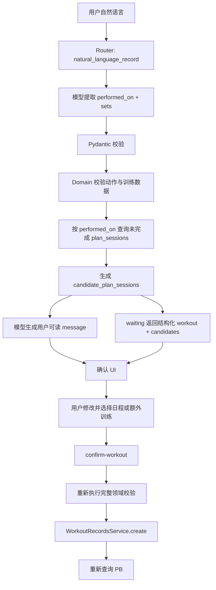

# Stage 6：自然语言打卡与项目收口

> 状态：**已完成**。Stage 5 已完成（`refactor-log/stage5.md`）；本文件是 Stage 6 契约、实施范围与验收正本。
> 实施按 §1.4 单链推进；每项完成时将对应复选框勾选为 `[x]`。
> 当前分支：`refactor/langgraph`。
> 权威顺序：`Fit-Agent-LangGraph-重构讨论总结.md` > `LANGGRAPH_REFACTOR_PLAN.md` > 已合入源码；Stage 5 日志仅作交接基线与既有约束正本。
> 本轮用户已拍定自然语言打卡的 SSE 载荷、日程关联字段与确认端点形状，正文 §2 与之对齐；实施与验收只依据本文件 §2 冻结契约与权威文档明文。

## 1. Stage 6 范围

### 1.1 交接基线（Stage 5 已保证，Stage 6 直接复用）

依据：`refactor-log/stage5.md` §1.1／§3／§7。

- 生成 → 评估 → 一次修订 → draft → 确认激活／拒绝归档全链路。
- adjustment 基于当前 active 生成新 draft，并复用同一确认链。
- checkpoint 优先 ＋ 唯一 draft 兜底的幂等确认（`PlanActivationService`）。
- Agent 三端点：`POST /api/agent/run`（SSE）、`/api/agent/confirm`、`/api/agent/reject`。
- 五类 SSE 产品事件：`node`／`message`／`waiting`／`done`／`error`。
- 五类封闭 Router；`natural_language_record` 已可被确定性命中，当前行为是「明确 Stage 6 未实现、不解析、不写库」。
- 表单打卡写入服务：`WorkoutRecordsService.create/update/delete`，含 `plan_session_id`／`auto_link` 与日程歧义错误。
- 计划页：active、draft、Evaluator 摘要、确认／拒绝、历史版本、生成／调整、SSE 进度。

### 1.2 本阶段交付

依据：讨论总结 §3.1／§9／§14；总计划 §10／§11「阶段 6」／§13／§14；`stage5.md` §7；本轮用户拍定的自然语言打卡契约。

1. 自然语言打卡的结构化提取：`performed_on`、动作、组序号、组类型、负重口径、重量、次数、计时时长。
2. 提取结果的 Pydantic 结构校验与领域规则校验（动作、日期、数值、负重口径）。
3. 按 `performed_on` 查询数据库得到 `candidate_plan_sessions`；`waiting` 返回结构化 `workout` 与该候选列表。
4. 解析确认专用 UI 与确认写入：`message` 只作可读摘要；确认编辑数据源为 `waiting.workout` 与 `waiting.candidate_plan_sessions`；用户确认后调用与表单相同的训练写入服务；返回写入结果与重新查询的 PB。
5. 用户修改日期、重量、次数、时长、组数或关联日程后，提交修改后的完整载荷，服务端重新执行 DTO/Pydantic 与领域校验。
6. 确认载荷未通过校验或日程关联校验时不写库；多候选且未显式选择时由既有领域规则产生日程歧义错误。
7. 自然语言入口页面（总计划 §7.2「对话页」）：承载自然语言记录与解析确认；保留进步解释入口。
8. 删除清单收口核对：确认旧 Runtime／通用草稿／Provider 数据库设置／费用代码／PydanticAI／RIR 运行时路径不存在；清理仍指向旧架构的文档与无用残留表述。
9. 更新 README：实际完成范围、未完成项、架构说明、启动方式、环境变量、数据库边界、演示所需的固定行为测试命令。
10. 后端测试、前端 build、人工闭环演示全部通过（Gate）。

### 1.3 明确不做

依据：讨论总结 §7／§8／§13／§14；总计划 §1.3／§7.3／§11；`stage5.md` §1.2／§7；本轮用户拍定契约。

- 通用业务草稿系统、`context_version`、旧 Run 状态机、费用账本、Provider 数据库存储。
- 自然语言解析草稿表、解析状态机、确认凭证；`WorkflowState` 不增加自然语言解析字段。
- RIR、估算 1RM、训练容量 PB、计划完成率、主观疲劳推断、医学诊断、新训练阈值。
- 扩展急性关键词词表或改变 10 项精确子串语义。
- 修改 `rejected` 语义；用户拒绝写 `rejected`。
- 在确认前修改 active 计划；模型进入数据库事务。
- Agent Swarm、Router 第三 Agent、A2A、插件注册中心、MCP、向量库、聊天摘要节点。
- 拖拽排程、完整计划编辑器、checkpoint 查询端点。
- 新增训练阈值或伤病→禁用动作的自动推导。
- 前端重算 PB／趋势／完成率；前端复制 Router 词表。
- 新增第六类 SSE 事件名；前端从 `message.text` 反向解析确认提交数据。
- 旧数据库迁移或兼容层。

### 1.4 实施子任务与完成标记

开发链路为单链：前序产出、后序消费。每项交付完成且对应验收通过后，将该项复选框改为 `[x]`；§5.4 全部满足后方可将文首状态改为已完成。

- [x] **T2.1 后端 Graph：NL 提取与 SSE waiting 双载荷**
  - 替换 `NATURAL_LANGUAGE_RECORD_UNIMPLEMENTED`：模型提取 `performed_on` + `sets` → Pydantic 结构校验 → Domain 校验 → 按 `performed_on` 查询未完成 `plan_sessions` → SSE `node` → `message` → `waiting`（`workout` + `candidate_plan_sessions`）→ `done`；确认前不写业务库；`WorkflowState` 不增加解析字段。
  - 依据：§2.1／§2.2／§2.3／§2.4.3／§3.1。
  - 后序：T2.2 与 T2.3 消费本步冻结的 `waiting` 载荷形状。

- [x] **T2.2 后端 API：confirm-workout**
  - 新增 `POST /api/agent/confirm-workout`；DTO 并入 `api/dto.py`；复用 `WorkoutRecordsService.create` 与既有 `plan_session_id`／`auto_link`／`PlanSessionLinkAmbiguous` 语义；PB 写入后经既有 Stats 服务重查；本端点不要求此前完成过自然语言解析的证明。
  - 依据：§2.2／§2.3／§2.4.2／§3.2。
  - 前序：T2.1；后序：T2.3。

- [x] **T2.3 前端契约**
  - `frontend/src/lib/contract.ts`、`api.ts` 对齐 `waiting` 双路径载荷与 `confirm-workout` 请求／响应；复用既有 SSE parser；事件名保持五类；确认提交数据只来自 `waiting` 结构化字段。
  - 依据：§2.4.3／§2.5／§3.3。
  - 前序：T2.1、T2.2；后序：T2.4。

- [x] **T2.4 前端对话页**
  - 新增对话页路由与导航；自然语言输入 → SSE → `message` 可读摘要 → 以 `waiting.workout`／`waiting.candidate_plan_sessions` 驱动确认 UI（多候选时必须选择具体日程或「额外训练」）→ `confirm-workout` → 失效记录／PB／趋势／日历／日程候选相关 Query；计划页只读展示（active／draft／历史）不回退。
  - 依据：§2.5／§3.3；总计划 §7.2.4。
  - 前序：T2.3；后序：T2.5。

- [x] **T2.5 测试闭环与 Gate 命令**
  - 测试覆盖 §5.1 确定性最小集；执行并通过 §5.2 全部 Gate 命令（`uv run pytest`、`uv run ruff check .`、`npm run build`）。
  - 依据：§5.1／§5.2。
  - 实测：后端全量 **501 passed**；`ruff check .` 通过；`npm run build` 通过；`verify:stage6` 14 组、`verify:stage5` 10 组断言通过。
  - 前序：T2.1–T2.4；后序：T2.6。

- [x] **T2.6 清理收口与人工闭环演示**
  - 完成 §2.7 删除／核对清单；按真实完成边界重写 `README.md` 与 `backend/README.md`；§5.3 人工闭环演示通过；§5.4 完成判定全部勾选后，将文首状态改为已完成。
  - 依据：§2.7／§3.4／§5.3／§5.4。
  - 前序：T2.5 Gate 通过。

## 2. 冻结契约

### 2.1 自然语言打卡链路

依据：讨论总结 §3.1／§4.1／§9；总计划 §10；`stage5.md` §2.6；本轮用户拍定契约。

```text
用户自然语言请求
  → 封闭词表安全预检（先于 Router，沿用 Stage 5）
  → Router 命中 natural_language_record（确定性规则优先）
  → 模型提取 performed_on + sets
  → Pydantic 结构校验
  → Domain 校验动作与训练数据
  → 按 performed_on 查询未完成 plan_sessions
  → 得到 candidate_plan_sessions
  → 模型生成用户可读 message
  → waiting 返回结构化 workout + candidate_plan_sessions
  → 前端确认 UI（编辑 waiting 载荷）
  → 用户修改并选择日程或额外训练
  → POST /api/agent/confirm-workout
  → 重新执行完整领域校验
  → WorkoutRecordsService.create
  → 重新查询 PB
```



硬边界：

| 事项 | 规则 | 依据 |
| --- | --- | --- |
| 写入前确认 | 未确认不写业务库 | 讨论总结 §3.1；总计划 §10／阶段 6 Gate |
| 解析失败 | 不写库，返回可读失败原因 | 总计划 §10 |
| 日程候选来源 | `candidate_plan_sessions` 来自按 `performed_on` 查询数据库的未完成日程；`waiting` 直接使用该查询结果 | 本轮用户拍定；已合入源码 `WorkoutRecordsService.list_unfinished_plan_sessions` |
| 模型提取范围 | 模型提取 `performed_on` 与 `sets`；可读动作目录将自然语言匹配为稳定 `exercise_id`；可读候选查询结果以生成 `message` 文本 | 本轮用户拍定；总计划 §10 |
| 候选 ID | 模型不得生成不存在的候选 `plan_session_id`；`waiting.candidate_plan_sessions` 禁止使用模型重新生成的 ID 或候选集合 | 本轮用户拍定 |
| 日程关联规则 | 完全沿用 Stage 1 已冻结的表单关联规则与 `WorkoutRecordsService` 现有语义 | 讨论总结 §9；总计划 §5.4；已合入源码 `domain/records/service.py` |
| 自动关联字段 | 恰一个未完成日程：`plan_session_id=null` 且 `auto_link=true`，确认写入时由既有服务解析唯一候选 | 本轮用户拍定；已合入源码 `auto_link` |
| 零候选 | 与「多候选未选择」同口径：保持 `plan_session_id=null` 且 `auto_link=true` 时由既有领域规则产生日程歧义错误且不写库；用户必须显式选择「额外训练」（`plan_session_id=null` 且 `auto_link=false`）才写为额外训练 | 讨论总结 §9；已合入源码 `domain/records/service.py`／`tests/test_stage1_api_records.py` |
| 多候选 | 系统不得自动选择；确认 UI 必须展示数据库候选，要求用户选择具体日程或「额外训练」 | 讨论总结 §9；本轮用户拍定 |
| 多候选未选择 | 保持 `plan_session_id=null` 且 `auto_link=true`；确认接口由既有领域规则产生日程歧义错误，不写库 | 本轮用户拍定；已合入源码 `PlanSessionLinkAmbiguous` |
| 显式选择日程 | `plan_session_id=<用户选择的 id>` 且 `auto_link=false` | 本轮用户拍定；已合入源码「显式 id 优先于 auto_link」 |
| 显式额外训练 | `plan_session_id=null` 且 `auto_link=false` | 本轮用户拍定 |
| 写入服务 | 确认后调用既有 `WorkoutRecordsService`，不新建第二套写入路径 | 总计划 §10；`stage5.md` §7 |
| 草稿系统 | 解析确认是专用路径，不复活通用草稿表／草稿 API | 总计划 §10；讨论总结 §8 |
| 确认凭证 | `/api/agent/confirm-workout` 不要求服务端证明当前 `conversation_id` 此前完成过一次自然语言解析 | 本轮用户拍定 |
| PB | 写入成功后由确定性统计现算并返回，模型不计算 PB | 讨论总结 §3.2／§7.1 |
| 模型边界 | 模型只做结构化提取与可见说明；不写库、不进事务、不重算统计、不决定候选日程集合 | 讨论总结 §3.2／§10；`stage5.md` §7 |

### 2.2 提取与校验 Schema

依据：讨论总结 §3.1／§9；总计划 §5.4／§10；已合入源码 `domain/records/*`、`domain/actions/*`；本轮用户拍定契约。

模型结构化提取结果：

- `performed_on`：业务自然日；
- `sets`：每条含动作稳定 `exercise_id`、`set_no`、`set_type`（`work / warmup / assisted`）、按动作口径区分的 `weight_kg`／`reps`／`duration_seconds`、适用的负重口径。

模型可使用已录入的 `exercise_dataset`／动作目录，将用户自然语言中的动作匹配为稳定 `exercise_id`。

服务端在模型输出完成后必须再次验证：

- `exercise_id` 存在于动作目录；
- 动作记录类型正确；
- 负重口径正确；
- 重量、次数、时长字段满足对应动作规则。

`waiting.workout`（前端确认 UI 的编辑数据源）包含：

- `performed_on`；
- `sets`；
- `plan_session_id`：`number | null`；
- `auto_link`：`boolean`。

`waiting.candidate_plan_sessions`：

- 模型解析得到 `performed_on` 后，查询数据库中该日期的未完成 `plan_sessions`；
- 该列表是数据库业务事实；
- `waiting.candidate_plan_sessions` 直接使用数据库查询结果。

确认提交载荷（用户可修改后的完整值）：

- `performed_on`、`sets`；
- `plan_session_id`、`auto_link`。

校验分层（顺序固定，与表单路径同一套规则）：

1. **Pydantic／DTO**：字段存在性、类型、枚举；未声明字段拒绝。
2. **领域规则**：日期、数值范围、动作存在于目录、负重口径与动作一致、外加重量／纯自重／计时的必填与互斥字段、组数与组序号、日程关联规则。
3. **确认写入**：再次调用与表单相同的领域校验与 `WorkoutRecordsService`；修改后的载荷走同一路径。

`POST /api/agent/confirm-workout` 在下列任一情况不写库：

- 确认载荷未通过 DTO/Pydantic 校验；
- 未通过领域规则校验；
- 未通过动作目录校验；
- 未通过日程关联校验。

不得出现 RIR、估算 1RM、训练容量或完成率字段。

### 2.3 解析确认的提交与状态

依据：总计划 §10「不复活通用草稿系统」「未确认不写库」「用户修改解析结果时重新走同一校验」；讨论总结 §3.1；`stage5.md` §7「必须保持」；本轮用户拍定契约。

- 解析结果无需写入数据库；确认前不得写入 `workout_sessions`／`workout_sets`／`plans`。
- 不新增解析草稿、解析状态机或确认凭证。
- 客户端在确认前持有 `waiting.workout` 与 `waiting.candidate_plan_sessions`；确认请求提交完整载荷（含用户可能修改后的值）。
- 服务端对确认请求重新做 §2.2 全部校验，通过后才调用表单写入服务。
- `/api/agent/confirm-workout` 不要求服务端证明当前 `conversation_id` 此前完成过一次自然语言解析。
- 不新增通用草稿表、草稿状态机或 `context_version`。
- `WorkflowState` 保持 Stage 3–5 冻结结构，不增加自然语言打卡解析字段。
- 解析确认与计划确认是两条独立链路：计划确认继续走既有 `/api/agent/confirm`／`reject` 与 `PlanActivationService`；自然语言打卡确认不得写计划状态。

### 2.4 HTTP 与 SSE

依据：总计划 §9.4／§10；`stage5.md` §2.7／§2.8／§7；本轮用户拍定契约。

#### 2.4.1 既有端点保持

```text
POST /api/agent/run
body: { conversation_id: string, request: string, regenerate?: boolean }
→ text/event-stream

POST /api/agent/confirm
body: { conversation_id: string, plan_id: number }
→ 200 { plan: PlanWire }

POST /api/agent/reject
body: { conversation_id: string, plan_id: number }
→ 200 { plan: PlanWire }
```

计划确认／拒绝契约不变。Stage 5 的计划路径 SSE 契约保持不变。

#### 2.4.2 自然语言打卡确认端点（本阶段新增）

```text
POST /api/agent/confirm-workout
body: {
  conversation_id: string,
  performed_on: string,
  sets: [...],
  plan_session_id: number | null,
  auto_link: boolean
}
→ 200 { workout_session: <与表单写入一致的传输对象>, personal_bests: [...] }
```

规则：

- `conversation_id` 必须为 UUID；非法形状在处理前返回既有 JSON 错误形状。
- 确认载荷未通过 DTO/Pydantic 校验、领域规则校验、动作目录校验或日程关联校验时不写库。
- 日程关联完全沿用 Stage 1 已冻结规则与既有 `WorkoutRecordsService`：
  - 恰一个未完成日程：`plan_session_id=null` 且 `auto_link=true`，由服务解析唯一候选；
  - 零候选且保持 `auto_link=true`：领域歧义错误，不写库；用户显式选择「额外训练」（`plan_session_id=null` 且 `auto_link=false`）才写为额外训练；
  - 多候选且 `plan_session_id=null` 且 `auto_link=true`：领域歧义错误，不写库；
  - 用户选择具体日程：`plan_session_id=<id>` 且 `auto_link=false`；
  - 用户明确额外训练：`plan_session_id=null` 且 `auto_link=false`。
- 写入成功后返回落库训练事实与重新查询的 PB。
- 不回显 API Key、Base URL、模型名、SQL、文件路径或堆栈。
- 本端点不要求服务端证明当前 `conversation_id` 此前完成过一次自然语言解析。

#### 2.4.3 SSE 事件

沿用 Stage 5 已冻结的五类 SSE 事件，不新增事件类型：

| event | Stage 6 用法 |
| --- | --- |
| `node` | 阶段名，如 `natural_language_record` |
| `message` | 只承载面向用户展示的可读摘要；前端不得从 `message.text` 反向解析确认提交数据 |
| `waiting` | 需要用户确认的产品等待；计划路径与自然语言打卡路径使用同一事件名、不同载荷 |
| `done` | 正常结束：`ok=true`，`intent`；自然语言打卡路径 `draft_plan_id=null` |
| `error` | 流建立后运行错误：一个 `error` 后关闭 |

`waiting` 载荷：

计划确认路径保持 Stage 5 契约：

```json
{
  "draft_plan_id": 123
}
```

自然语言打卡路径：

```json
{
  "workout": {
    "performed_on": "2026-09-18",
    "sets": [],
    "plan_session_id": null,
    "auto_link": true
  },
  "candidate_plan_sessions": []
}
```

其中：

- `workout` 是前端确认 UI 的编辑数据源；
- `candidate_plan_sessions` 来自数据库查询；
- 用户修改日期、重量、次数、时长、组数或关联日程后，提交修改后的完整载荷；
- `/api/agent/confirm-workout` 服务端重新执行 DTO/Pydantic 与领域校验。

自然语言解析成功事件序列：

```text
node: natural_language_record
→ message: 用户可读摘要
→ waiting: 结构化训练结果 + 候选计划日程
→ done: intent=natural_language_record
```

`message` 示例：

```text
9 月 18 日：杠铃卧推 60kg，4 组 × 5 次；平板支撑 3 组 × 60 秒。
```

多候选时 `message` 可提示选择，例如：

```text
9 月 18 日存在两个尚未完成的计划日程，请选择本次训练对应的日程，或标记为额外训练。
```

约束：

- 事件名集合保持五类。
- 解析成功、失败、歧义都不写业务库；只有 `/api/agent/confirm-workout` 成功才写库。
- SSE 断线不是确认、取消或写入信号。
- 事件与错误文本不得泄漏密钥或 Provider 配置。
- Router 与模型调用继续共享既有 Run 预算（60s／180s／每 Run 最多 5 次模型请求）。

### 2.5 前端

依据：总计划 §7.2／§7.3／§10；讨论总结 §3.1；`stage5.md` §7；本轮用户拍定契约。

1. **对话页（新增）**：自然语言输入 → Agent Run SSE → `message` 展示可读摘要 → 以 `waiting.workout`／`waiting.candidate_plan_sessions` 作为确认 UI 编辑数据源 → 修改／确认／取消；确认调用 `/api/agent/confirm-workout`；写入成功后失效记录、PB、趋势、日历、日程候选相关 Query。
2. 前端不得从 `message.text` 反向解析确认提交数据。
3. 多候选时确认 UI 必须展示数据库查询得到的候选日程，并要求用户选择某个具体 `plan_session` 或「额外训练」。
4. **计划页**：只读展示 active、draft（结构化计划与 Evaluator 摘要）与历史版本；生成／调整计划入口与 draft 的确认／拒绝都在对话页（本轮裁决），本页不跑 `/api/agent/run`，也不调 `/api/agent/confirm`／`reject`，继续不写训练记录。
5. **记录页（保持）**：表单打卡路径不变；自然语言确认写入的是同一后端服务，前端不复制第二套校验规则。
6. **数据看板（保持）**：只展示后端统计；不新增完成率或力量趋势前端曲线。
7. 前端不复制 Router 词表，不重算 PB／趋势，不实现通用 DraftCard。
8. 无数据图表保持空态，不用零值补线。

### 2.6 Stage 5 必须保持的边界

依据：`stage5.md` §7；讨论总结 §3.4／§8；本轮用户拍定契约。

- `rejected` 语义不变：只表示 Evaluator 二次阻断失败；用户拒绝仍归档 draft，原 active 不变。
- 确认前不修改 active。
- 模型不进入数据库事务。
- 不新增训练阈值或医学规则。
- SSE 不泄漏密钥；不新增第六类 SSE 事件名。
- 急性关键词仍是 10 项精确子串；命中后仍先于 Router 进入 `safety_stop`。
- 禁用动作只来自画像中稳定的 `exercise_id`；系统不由伤病名推导禁用动作。
- `WorkflowState` 保持 Stage 3–5 冻结字段集合，不因打卡功能塞入完整业务历史、密钥或自然语言解析状态。
- MemoryAssembler 六类边界、SkillLoader 渐进加载语义不改。
- 计划状态仍为 `draft / active / archived / rejected`，不新增计划时间字段。

### 2.7 清理与文档收口

依据：总计划 §11「阶段 6」／§13／§14.3；`stage5.md` §7。

删除／核对清单（替代实现已通过 Stage 5 Gate，Stage 6 做最终核对与文档收口）：

| 项目 | 要求 |
| --- | --- |
| `backend/runtime/`、`backend/agent_core/` | 不得存在旧 Run／PydanticAI 运行时包 |
| 通用草稿 API／repo／路由 | 不得存在 |
| Provider 数据库设置、费用账本、旧 Summary 存储 | 不得存在 |
| RIR 字段／DTO／Prompt／测试 | 运行时路径不得存在 |
| 旧 migrations `001`–`016` 语义回流 | 新版迁移目录只保留当前 LangGraph Schema |
| `pydantic_ai` 依赖 | `pyproject.toml` 与生产导入不得出现 |
| 前端 DraftCard／Provider 设置页／旧复盘双路径 | 不得存在 |
| 根 `README.md` | 必须改为 Stage 6 真实状态：完成范围、未完成项、启动方式、环境变量、数据库不兼容说明、测试命令、架构说明 |
| `backend/README.md` | 不得继续描述旧 PydanticAI／草稿／Run Harness 架构；与真实目录一致 |
| 简历口径 | 只有代码、测试与演示均存在的模块才能写「已实现」 |

## 3. 目标实现

### 3.1 Graph 与模型提取

依据：总计划 §10／§9.1；`stage5.md` §3.2；已合入源码 `backend/graph/workflow.py`、`backend/graph/router.py`；本轮用户拍定契约。

- 保持五类 Router 与安全预检优先。
- 替换 `NATURAL_LANGUAGE_RECORD_UNIMPLEMENTED` 分支：命中 `natural_language_record` 时进入结构化提取。
- 模型提取范围：`performed_on` + `sets`；可读动作目录匹配稳定 `exercise_id`。
- 提取使用统一模型入口与既有 Run 预算；严格结构化输出，非法输出为 Run error。
- 提取节点不写业务库；领域校验失败以可见文本返回，不落库。
- 模型输出后按 `performed_on` 查询未完成 `plan_sessions`，得到 `candidate_plan_sessions`；`waiting` 使用该数据库结果。
- 模型可读取候选查询结果以生成用户可读 `message` 文本。
- 不把完整数据库历史写入 `WorkflowState`；打卡确认不依赖 MemoryAssembler 生成数值。

### 3.2 领域与 API

依据：总计划 §10／§6.1；已合入源码 `backend/domain/records/service.py`、`backend/api/routes_records.py`、`backend/api/routes_agent.py`；本轮用户拍定契约。

- 确认写入直接复用 `WorkoutRecordsService.create`。
- 日程候选查询复用 `list_unfinished_plan_sessions`；自动关联语义沿用 `auto_link` 与 `PlanSessionLinkAmbiguous`。
- 新增 `POST /api/agent/confirm-workout`；请求体含 `plan_session_id` 与 `auto_link`；DTO 校验与错误映射并入既有 `api/dto.py` 体系。
- 确认端点不要求「此前已完成自然语言解析」的证明。
- 写入成功后的 PB 读取复用既有 Stats 服务，不另写一套 PB SQL。
- 模型调用不在事务内；确认请求内不调用模型。

### 3.3 前端

依据：总计划 §7.2.4／§10；已合入源码 `frontend/src/lib/api.ts`、`contract.ts`、`App.tsx`；本轮用户拍定契约。

- 新增对话页路由与导航入口。
- 复用既有 SSE parser；按 §2.4.3 呈现自然语言 Run 进度。
- 确认组件以 `waiting.workout` 为编辑数据源，以 `waiting.candidate_plan_sessions` 展示候选；允许修改后再提交完整载荷。
- 确认成功后失效相关 Query；失败时展示后端产品错误，不猜测原因。
- 计划页保留只读展示（active／draft／历史）；生成／调整与确认／拒绝入口都在对话页。

### 3.4 文档与演示材料

依据：总计划 §14.3；`stage5.md` §7。

- README 更新为真实完成边界。
- 架构说明覆盖：FastAPI 单体、SQLite 业务库、独立 LangGraph Checkpointer 文件、Router、MemoryAssembler、SkillLoader、Planner／Evaluator、表单写入、自然语言解析确认。
- 启动方式与环境变量名与 `backend/config.py`、`.env.example` 一致。
- 演示材料只记录已通过测试与人工闭环的真实行为；未完成项必须明示。

## 4. 关键行为验收

### 4.1 自然语言提取与确认

- 确定性命中 `natural_language_record` 时，分类模型调用为 0。
- `natural_language_record` 成功后 SSE 事件类型仍只出现 Stage 5 五种：`node`／`message`／`waiting`／`done`／`error`（成功路径通常无 `error`）。
- `message` 为用户可读文本。
- `waiting` 返回结构化 `workout` 与数据库产生的 `candidate_plan_sessions`。
- 前端无需解析 `message.text` 获取确认字段。
- 模型提取结果缺少必填字段、动作不在目录、负重口径不符、非法日期／次数／时长：确认前即拒绝，库内无新训练行。
- 模型不得生成不存在的候选 `plan_session_id`。
- 未调用确认端点时，`workout_sessions`／`workout_sets` 行数不变。
- 确认后写入事实与表单路径一致；返回的 PB 等于确定性查询结果。
- 用户修改解析出的训练字段后，确认端点按修改后的完整载荷重新校验并写入。
- 取消确认：不写库。
- 直接调用 `/api/agent/confirm-workout` 时无需检查「此前是否完成过自然语言解析」。

### 4.2 日程关联

- 候选计划日程由 `performed_on` 查询数据库获得。
- 当天恰好一个未完成计划日程：`plan_session_id=null` 且 `auto_link=true` 时允许自动关联；确认后 `plan_session_id` 等于该日程。
- 当天没有未完成计划日程：`plan_session_id=null` 且 `auto_link=true` 时既有领域服务产生日程歧义错误且不写库；用户显式选择「额外训练」（`plan_session_id=null` 且 `auto_link=false`）后以额外训练写入。
- 当天存在多个未完成计划日程：系统不得自动选择；确认 UI 必须展示数据库候选。
- 多候选且保持 `plan_session_id=null` 且 `auto_link=true` 时确认返回日程歧义错误且不写库。
- 多候选时用户显式选择某一 `plan_session_id`（`auto_link=false`）后正常写入。
- 多候选时用户显式选择额外训练（`plan_session_id=null` 且 `auto_link=false`）后以额外训练写入。
- 同一日程最多被一次有效训练关联；冲突时报错且不写入。

### 4.3 安全与计划边界

- 急性关键词命中：不解析打卡、不调用 Planner、不写库，仍走既有 `safety_stop` 文本。
- 自然语言打卡确认不改变任何 `plans` 状态。
- 确认打卡失败不影响当前 active 计划。
- `WorkflowState` 字段集合保持 Stage 5 既有契约，不新增自然语言解析状态。
- 全链路无 RIR／完成率／估算 1RM 写入或展示。

### 4.4 清理与文档

- 生产代码无 PydanticAI、旧 Runtime 包、通用草稿、Provider 数据库设置、费用账本。
- README 与真实目录、启动命令、环境变量一致。
- 后端测试、`ruff`、前端 build 通过。
- 人工闭环演示覆盖：表单打卡 → 看板／PB → 生成计划 → 评估 → 确认启用 → 自然语言打卡确认 → 记录与 PB 更新。

## 5. 测试与 Gate

### 5.1 确定性测试最小集

依据：总计划 §12；`stage5.md` §5；本轮用户拍定契约。

- Router：`natural_language_record` 单命中不调用分类模型。
- SSE：`natural_language_record` 成功后仍只出现 Stage 5 五种事件类型。
- `message` 为用户可读文本；前端断言不从 `message.text` 提取确认字段。
- `waiting` 返回结构化 `workout` 与数据库产生的 `candidate_plan_sessions`。
- 候选计划日程由 `performed_on` 查询数据库获得；模型不得生成不存在的候选 `plan_session_id`。
- 提取 Schema：合法载荷通过；缺字段、未知动作、口径不符、非法数值被拒绝。
- 确认前不写库；解析失败／歧义／未确认均无新行。
- 唯一未完成日程允许自动关联（`plan_session_id=null` 且 `auto_link=true`）。
- 零候选且 `auto_link=true` 时确认返回日程歧义错误且不写库。
- 零候选时显式选择额外训练（`plan_session_id=null` 且 `auto_link=false`）后以 `plan_session_id=null` 写入。
- 多候选且 `auto_link=true` 时确认返回日程歧义错误且不写库。
- 多候选时显式选择某一 `plan_session_id` 后正常写入。
- 多候选时显式选择额外训练后以 `plan_session_id=null` 写入。
- 用户修改解析出的训练字段后，确认端点按修改后的完整载荷重新校验。
- 直接调用 `/api/agent/confirm-workout` 时无需检查「此前是否完成过自然语言解析」。
- `WorkflowState` 字段集合保持 Stage 5 既有契约，不新增自然语言解析状态。
- 确认写入与表单服务同源：同一载荷经表单 API 与确认 API 得到一致领域结果（在相同输入下）。
- 确认成功返回的 PB 与确定性统计一致。
- 急性关键词仍先于 Router；打卡确认不影响计划状态。
- API Key／Provider 配置不出现在响应、SSE 与错误详情。

Graph 行为测试使用固定模型替身，不依赖真实模型随机性验证硬规则。

### 5.2 Gate 命令

```bash
cd backend && uv run pytest
cd backend && uv run ruff check .
cd frontend && npm run build
```

Stage 6 命名测试文件以实施时实际新增为准，至少覆盖 §5.1；全量 pytest 必须通过。

### 5.3 人工闭环演示

依据：总计划 §11「阶段 6」Gate／§14。

演示必须通过后，Stage 6 才可标记完成：

1. 临时数据目录启动新版应用，确认创建 `fit_agent_langgraph.db` 而非旧库。
2. 表单新增训练与身体数据，看板展示日历、趋势、PB。
3. 生成计划 → Evaluator → （如触发）一次修订 → draft。
4. 确认启用：任意时刻仅一个 active；拒绝路径原计划不变。
5. 对话页自然语言打卡：`message` 可读摘要 → `waiting` 结构化载荷驱动确认 UI → 确认写入 → 记录页与 PB 立即一致。
6. 构造日程歧义：多候选时不自动关联，必须选择具体日程或额外训练。
7. 急性关键词请求：不生成计划、不写打卡。

### 5.4 完成判定

Stage 6 完成需同时满足：

- [x] §4 行为验收全部有测试或演示证据；
- [x] 后端 pytest、ruff、前端 build 通过；
- [x] §5.3 人工闭环演示通过；
- [x] README 与真实完成边界一致，旧架构表述已清除；
- [x] 删除清单核对无旧路径残留；
- [x] Stage 5 必须保持的边界（§2.6）未破坏。

## 6. 主要预期修改文件

实施时以实际 diff 为准，范围限定在：

```text
backend/graph/workflow.py
backend/graph/nodes.py          # 如提取节点落在图内
backend/graph/model.py          # 如需共用结构化输出入口
backend/api/routes_agent.py
backend/api/dto.py
backend/api/app.py              # 确认写入服务装配
backend/domain/records/…        # 仅当确认载荷与既有服务之间缺纯校验适配
backend/tests/test_stage6_*.py

frontend/src/lib/contract.ts
frontend/src/lib/api.ts
frontend/src/features/chat/…    # 对话页
frontend/src/app/App.tsx

README.md
backend/README.md
```

不修改：计划状态机、激活事务语义、PB 计算口径、安全词表、MemoryAssembler 六类边界、SkillLoader 渐进加载语义、`WorkflowState` 字段集合。

## 7. 依据索引

| 契约点 | 权威依据 |
| --- | --- |
| 自然语言先回显再确认写入 | 讨论总结 §3.1 |
| 日程关联：唯一候选可自动关联，否则用户选择 | 讨论总结 §9；总计划 §5.4 |
| Stage 1 已冻结的 `plan_session_id`／`auto_link`／歧义错误 | 已合入源码 `backend/domain/records/service.py` |
| 解析确认不复活通用草稿 | 总计划 §10；讨论总结 §8 |
| 模型提取字段与服务端复验 | 总计划 §10；本轮用户拍定契约 |
| `candidate_plan_sessions` 来自数据库查询 | 本轮用户拍定；已合入源码 `list_unfinished_plan_sessions` |
| `waiting` 双路径载荷与五类事件不扩 | `stage5.md` §2.8；本轮用户拍定契约 |
| `confirm-workout` 请求体含 `auto_link` | 本轮用户拍定契约 |
| 确认不要求此前解析证明、State 不加解析字段 | 本轮用户拍定契约 |
| 复用表单写入服务 | 总计划 §10／§11 阶段 6；`stage5.md` §7 |
| SSE 用于 Graph Run 进度与结果 | 总计划 §9.4 |
| 五类 Router 与 NL intent 现状 | `stage5.md` §2.6；`backend/graph/router.py`；`backend/graph/workflow.py` |
| 五类 SSE 与 Agent 三端点 | `stage5.md` §2.7／§2.8 |
| Stage 6 必须保持边界 | `stage5.md` §7 |
| 删除清单与 README 收口 | 总计划 §13／§14.3；§11 阶段 6 |
| Gate：未确认不写库；歧义不自动关联 | 总计划 §11 阶段 6 Gate |
| PB 现算、LLM 只解释 | 讨论总结 §3.2／§7.1 |
| 计划确认幂等与 rejected | 讨论总结 §3.4；`stage5.md` §2.1／§2.2 |

## 8. 实施约束

- 有决策型问题不编造、不假设；权威文档未明文且源码无既有约束时，先询问用户。
- 审查与验收必须给出源码或文档依据索引。
- 非「讨论总结明文 ＋ 已合入源码既有约束 ＋ 本轮已拍 Stage 6 契约」的改动不做；确有必要先取得用户同意。
- 临时产物写入本地已配置 gitignore 的目录；禁止读写 `/tmp`。
- 代码出错就地失败，不捕获后降级，不使用 Mock 绕过真实校验。
- 必须闭环执行实现—运行—测试—迭代，Gate 通过后才可把本文件状态改为已完成。
